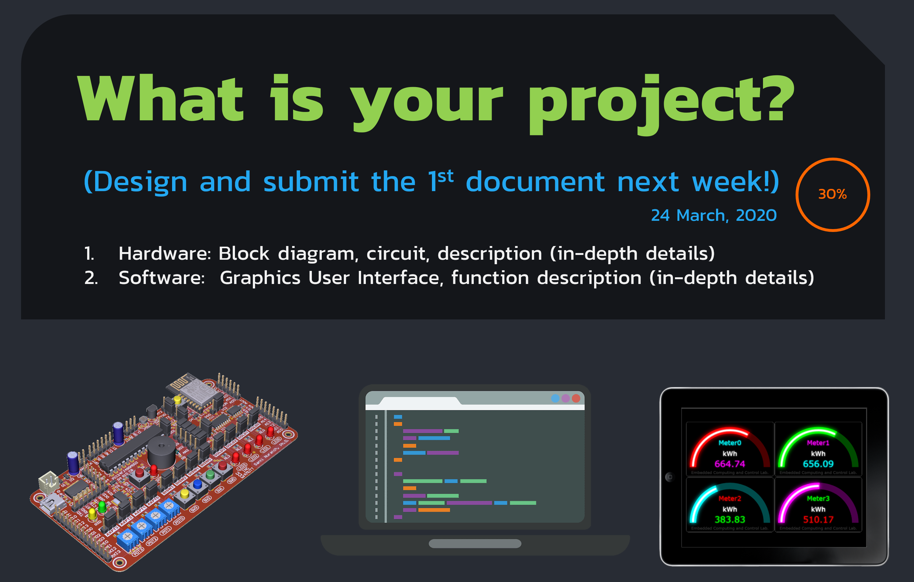
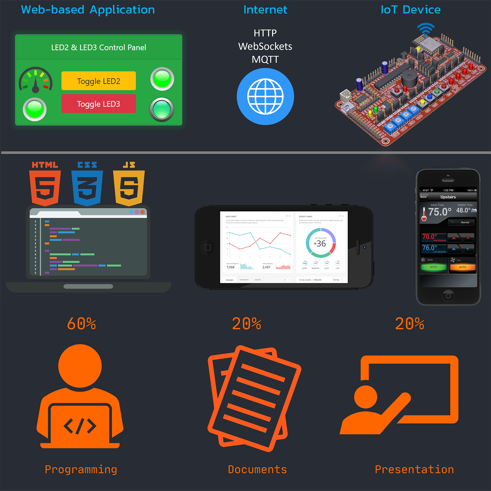

# INC281-2020

News, Documents, Videos and other resources for `INC281` will be provided in this repository.

---

## :pushpin: 1st Assignment (30%)

- :warning: The high quality of document must be submitted on **8 April, 2020**

- :e-mail: Submit the document as PDF file to **santi.inc.kmutt@gmail.com**

> :page_facing_up: Example document can be downloaded [here](resources/docs/INC281-2020-example-document.pdf)

---

## News

:pushpin: **18 March, 2020** : No class. But you have to complete the **Lab01**, **Lab02** and the **Lec-Lab-01**.

:pushpin: **22 March, 2020** : Please complete the **Lec-Lab-02**.

:pushpin: **24 March, 2020** : Please complete the **Lec-Lab-03**.

:pushpin: **25 March, 2020** : Please check the first video for more details about our class and your first **assignment**.

:pushpin: **26 March, 2020** : Please check the second video for Basic HTML programming.

:pushpin: **01 April, 2020** : The video of the Basic CSS and Bootstrap is uploaded.

:pushpin: **04 April, 2020** : The **Lab03 Install VSPD** is uploaded.

:pushpin: **04 April, 2020** : The **virtual-serial-port-driver-6.9.rar** is uploaded (check in the `Software tool` section below).

> Please pay your time to practice the three programming languages, **HTML**, **CSS** and **JavaScript**

> Download the lecture notes and labsheets below.

---

## :movie_camera: Videos

1) [Introduction to INC281 and the first assignment](https://www.youtube.com/watch?v=0dBNmv72LGg)

2) [Basic HTML Programming](https://www.youtube.com/watch?v=T6wu_dAlLjQ)

3) [Basics of CSS and Bootstrap](https://www.youtube.com/watch?v=QPhMT3NKhJI)

---

## :books: Documents

:page_facing_up: [INC281-2020-Lec-Lab-01](resources/docs/INC281-2020-Lec-Lab-01-Into-HTML.pdf) - **Introduction** and **Basic HTML**

:page_facing_up: [INC281-2020-Lec-Lab-02](resources/docs/INC281-2020-Lec-Lab-02-CSS.pdf) - **Basic CSS** and **Bootstrap**

:page_facing_up: [INC281-2020-Lec-Lab-03](resources/docs/INC281-2020-Lec-Lab-03-JavaScript.pdf) - **Basic JavaScript Programming**

> Please pay your time to practice the three programming languages, **HTML**, **CSS** and **JavaScript**

---

:page_facing_up: [INC281-2020-Lab01](resources/docs/INC281-2020-Lab01-Install-VSCode.pdf) - Download and Install the **VSCode**

:page_facing_up: [INC281-2020-Lab02](resources/docs/INC281-2020-Lab02-Install-LiveServer.pdf) - Install the **Live Server**

:page_facing_up: [INC281-2020-Lab03](resources/docs/INC281-2020-Lab03-Install-VSPD.pdf) - Install the **VSPD**

> Other documents and Videos will be provided here soon.

---

## :computer: Software tools

[virtual-serial-port-driver-6.9.rar](resources/software-tools/virtual-serial-port-driver-6.9.rar)

> :warning:**Extract** the file and run the installer as **administrator** (Right-click and choose **Run as administrator****)

---

## :dart: Design and build your own IoT application.

---
